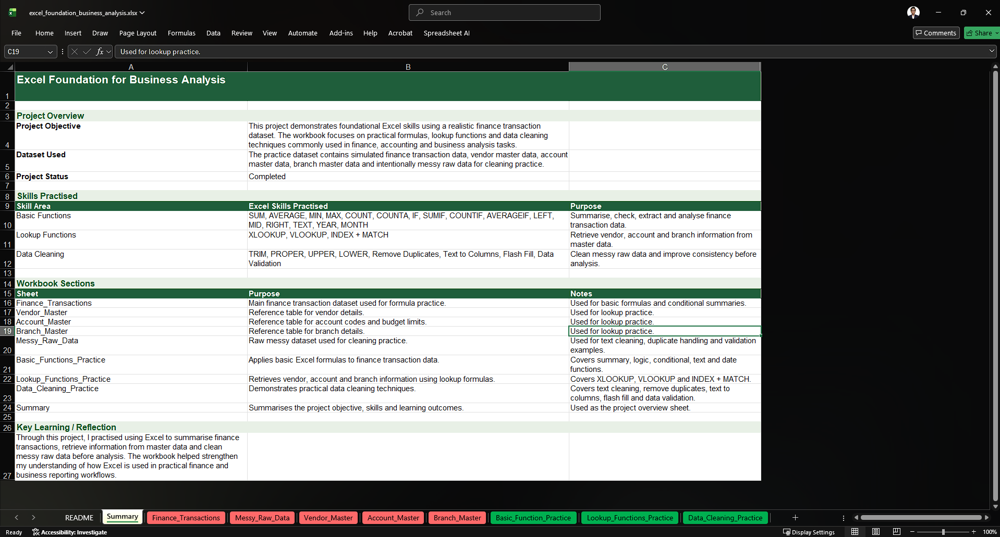
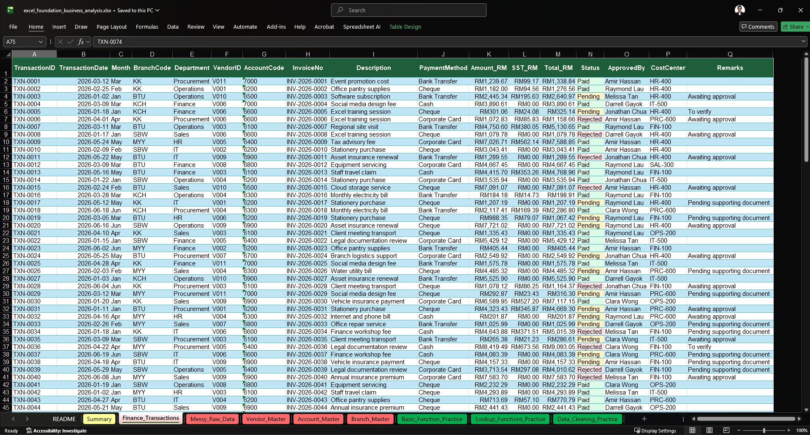
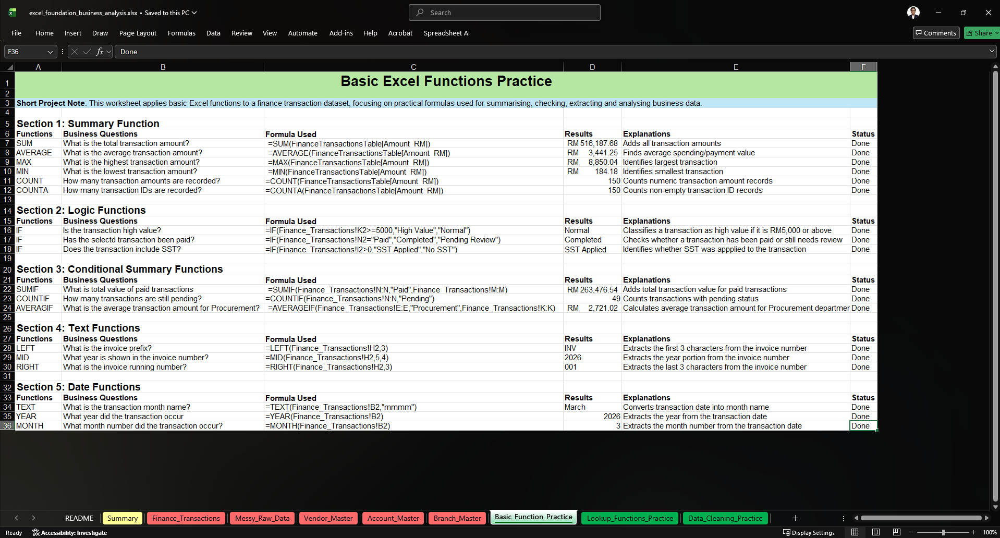
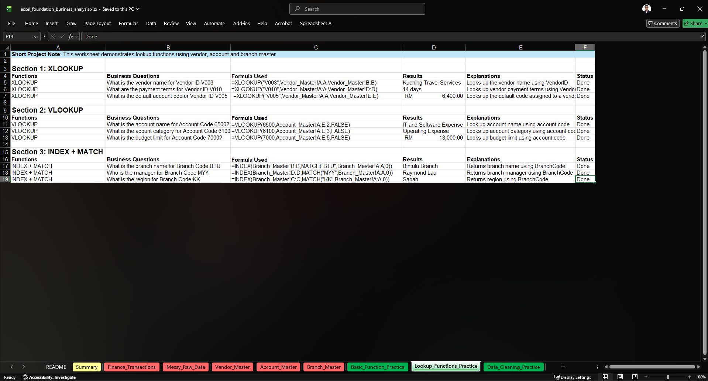
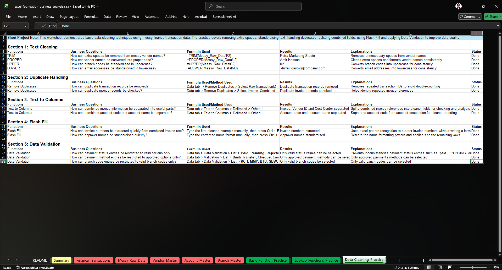
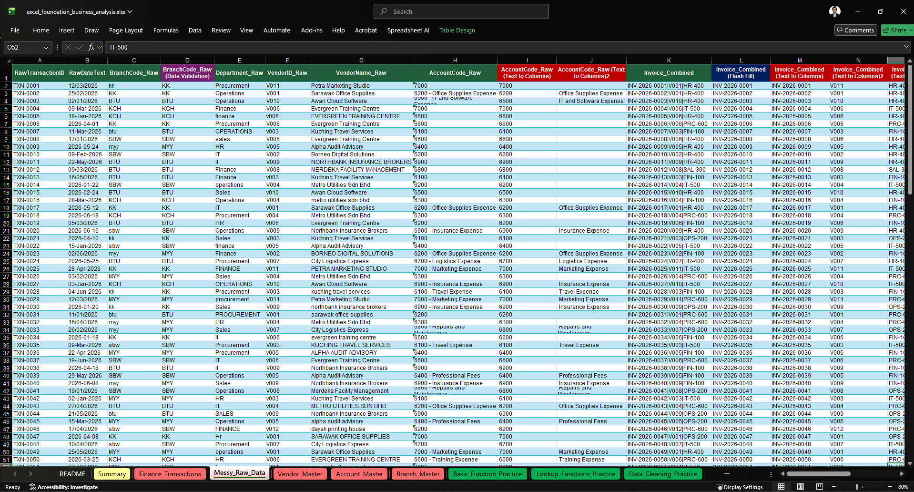
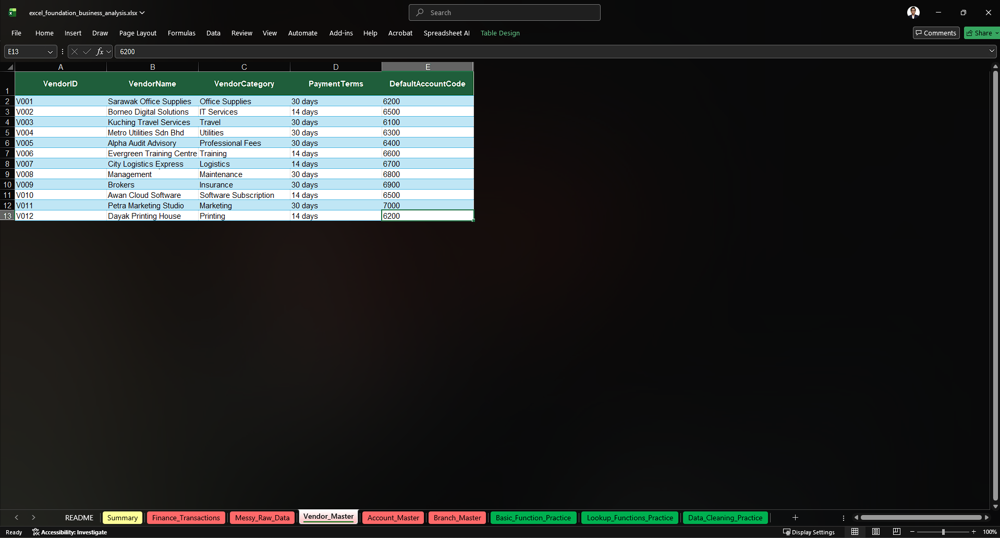
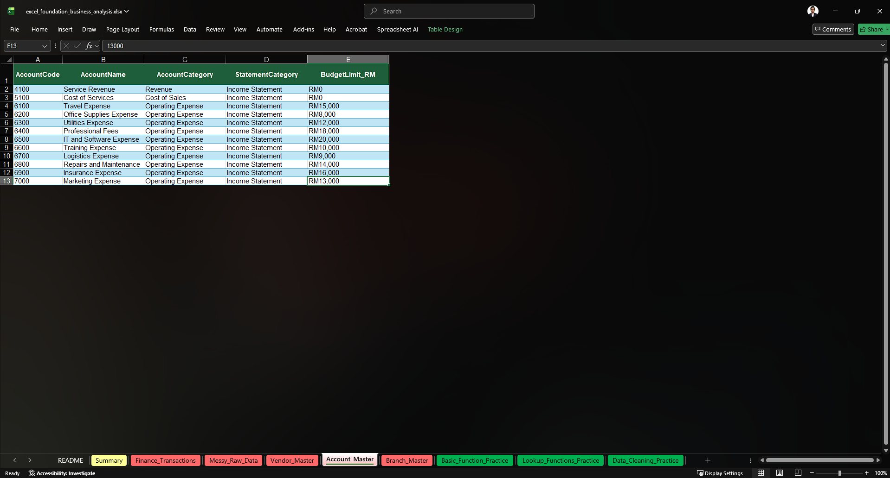
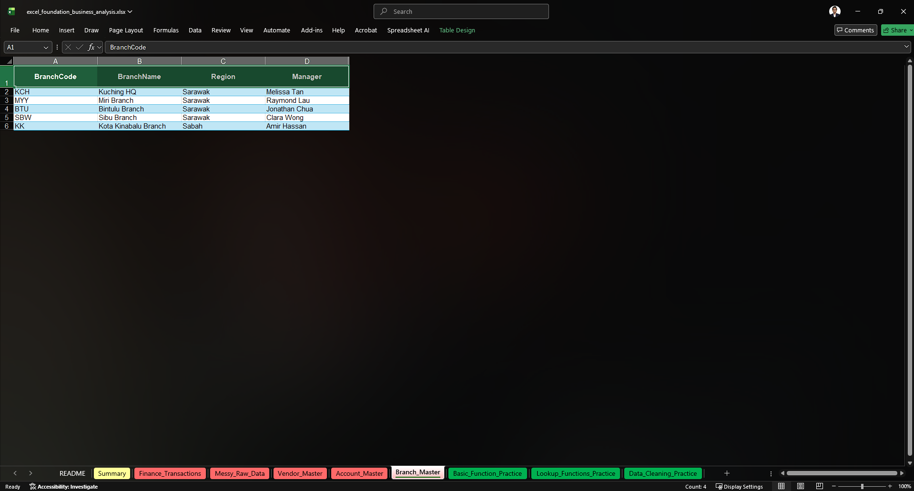

# Excel Foundation for Business Analysis

## Project Overview

This project is an Excel foundation portfolio project designed to demonstrate practical spreadsheet skills using a realistic finance transaction dataset.

The workbook focuses on basic Excel functions, lookup functions and data cleaning techniques commonly used in finance, accounting and business analysis tasks. The goal of this project is to show how Excel can be used to summarise transactions, retrieve information from master data and clean messy raw data before analysis.

## Repository Structure

```text
excel-foundation-business-analysis/
├── README.md
├── workbook/
│   └── excel_foundation_business_analysis.xlsx
└── images/
    ├── 01-summary.png
    ├── 02-finance-transactions.png
    ├── 03-basic-functions-practice.png
    ├── 04-lookup-functions-practice.png
    ├── 05-data-cleaning-practice.png
    ├── 06-messy-raw-data.png
    ├── 07-vendor-master.png
    ├── 08-account-master.png
    └── 09-branch-master.png
```

## Workbook Sheets

| Sheet                     | Purpose                                                                           |
| ------------------------- | --------------------------------------------------------------------------------- |
| README                    | Provides a brief explanation of the workbook and learning flow                    |
| Summary                   | Summarises the project objective, dataset, skills practised and workbook sections |
| Finance_Transactions      | Main finance transaction dataset used for formula practice                        |
| Messy_Raw_Data            | Intentionally messy finance data used for data cleaning practice                  |
| Vendor_Master             | Reference table for vendor details and default account codes                      |
| Account_Master            | Reference table for account codes, account names, categories and budget limits    |
| Branch_Master             | Reference table for branch codes, branch names, regions and managers              |
| Basic_Function_Practice   | Applies basic Excel functions to finance transaction data                         |
| Lookup_Functions_Practice | Uses lookup functions to retrieve vendor, account and branch information          |
| Data_Cleaning_Practice    | Demonstrates data cleaning techniques using messy raw data                        |

## Skills Practised

### Basic Excel Functions

The workbook includes practice using foundational formulas such as:

* `SUM`
* `AVERAGE`
* `MIN`
* `MAX`
* `COUNT`
* `COUNTA`
* `IF`
* `SUMIF`
* `COUNTIF`
* `AVERAGEIF`
* `LEFT`
* `MID`
* `RIGHT`
* `TEXT`
* `YEAR`
* `MONTH`

These formulas are applied to practical finance-related questions such as total transaction value, average transaction amount, high-value transaction checks, paid transaction summaries, invoice extraction and monthly reporting.

### Lookup Functions

The project also includes lookup practice using master data tables:

* `XLOOKUP`
* `VLOOKUP`
* `INDEX + MATCH`

These functions are used to retrieve vendor names, payment terms, default account codes, account categories, budget limits, branch names, regions and managers.

### Data Cleaning

The data cleaning section demonstrates basic techniques such as:

* `TRIM`
* `PROPER`
* `UPPER`
* `LOWER`
* Remove Duplicates
* Text to Columns
* Flash Fill
* Data Validation

These techniques are used to clean messy vendor names, branch codes, approver names, email addresses, invoice references, account descriptions and payment status entries.

## Dataset Description

The dataset used in this project is fictional and created for portfolio/practice purposes only.

It includes simulated finance-related data such as:

* Transaction IDs
* Transaction dates
* Branch codes
* Department names
* Vendor IDs
* Vendor names
* Account codes
* Invoice references
* Payment methods
* Transaction amounts
* SST amounts
* Payment status
* Approver names
* Email addresses
* Remarks

The dataset is designed to reflect common finance and administrative data tasks in a simple and beginner-friendly way.

## Project Preview

### Summary Sheet



### Finance Transactions



### Basic Functions Practice



### Lookup Functions Practice



### Data Cleaning Practice



### Supporting Data Tables

#### Messy Raw Data



#### Vendor Master



#### Account Master



#### Branch Master



## Key Learning

Through this project, I practised using Excel to perform practical business and finance tasks, including summarising transaction data, applying conditional calculations, extracting text, working with dates, retrieving information from master data and cleaning messy raw data.

This project helped strengthen my understanding of how Excel is used in finance, accounting and business reporting workflows.

## Tools Used

* Microsoft Excel
* GitHub

## Project Status

Completed

## Note

All data used in this project is fictional and created for portfolio/practice purposes only.
